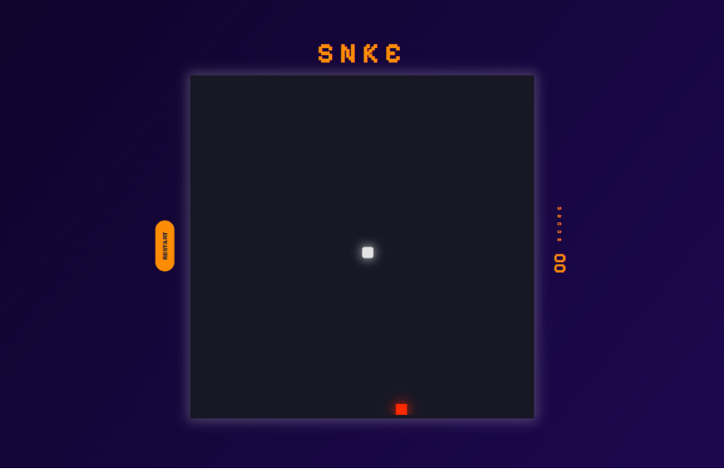

# 🐍 Snake Game em JavaScript

Este é um simples jogo da cobrinha criado em JavaScript puro.

## 🔗 Live

Veja o jogo em ação [aqui](https://codepen.io/La-s-Lara/pen/OJGyobq).

## 🎮 Como Jogar

1. Abra o arquivo `index.html` no seu navegador.
2. Use as setas do teclado para mover a cobra.
3. Coma a comida para aumentar o tamanho da cobra e marcar pontos.
4. Evite colidir com as bordas do campo de jogo ou com o próprio corpo da cobra.
5. A pontuação máxima será salva localmente no seu navegador.

## 🚀 Tecnologias Utilizadas

- HTML5
- CSS3
- JavaScript

## 📦 Instalação

Não é necessário instalar nada. Basta abrir o arquivo `index.html` em um navegador da web compatível com JavaScript.

## 🤝 Contribuições

Contribuições são bem-vindas! Sinta-se à vontade para enviar sugestões, relatar problemas ou enviar pull requests para melhorar este jogo.

## 📄 Licença

Este projeto está licenciado sob a [Licença MIT](https://opensource.org/licenses/MIT).
